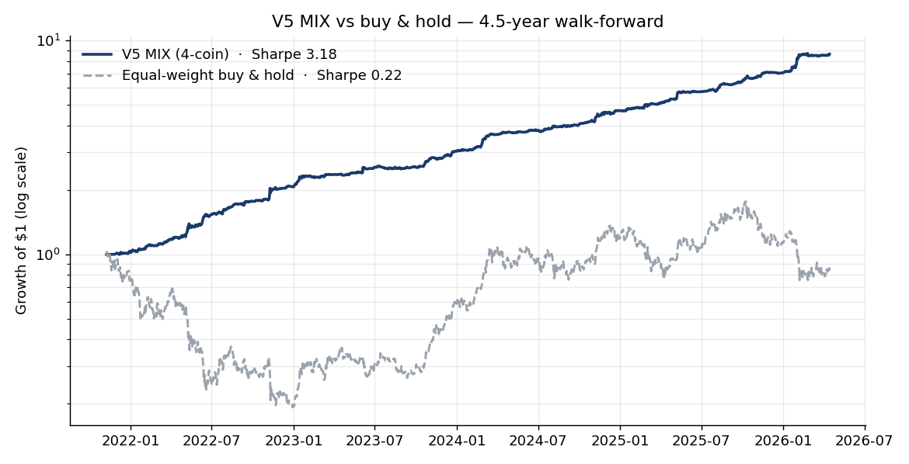
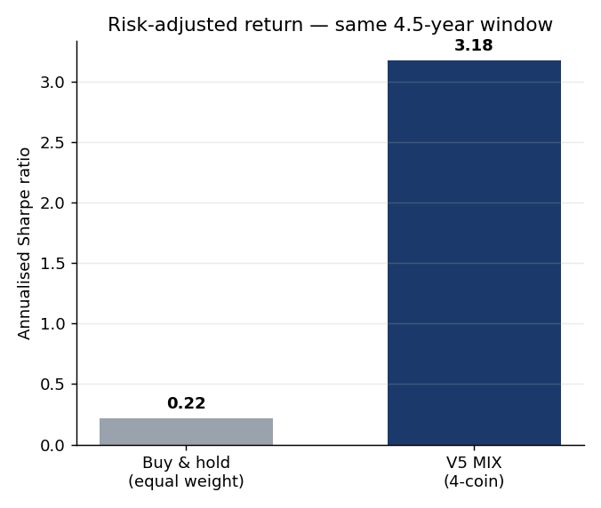

<!-- Internal note: a factual account of how the project developed, framed as
experiment -> problem found -> correction. More detailed than a summary, more
readable than the raw experiment log, and more compact than the thesis.
Keep the tone neutral and factual. -->

# Progress Report — from Krypto-v0 to a live trading desk

This report traces how the project developed, from the initial Krypto-v0
prototype to the system now running live. Each stage is described as an
**experiment**, the **problem** it surfaced, and the **correction** that
followed. The aim is to make the reasoning legible: why each design choice was
made, what evidence supported it, and which directions were tried and set aside.

A few terms used throughout:
- **Look-ahead bias** — when information that would not have been available at
  prediction time leaks into training or feature construction, inflating measured
  performance relative to what is achievable in real use.
- **Walk-forward / out-of-sample (OOS)** — train only on data preceding the test
  window, evaluate only on later, unseen data. The core honesty check for any
  trading strategy.
- **Directional accuracy** — the share of predictions that get the *sign* of the
  next move right. For trading this matters more than regression fit (R²), since
  PnL depends on direction, not on the size of the fitted residual.
- **Sharpe ratio (SR)** — annualised return divided by annualised volatility; a
  standard risk-adjusted performance measure. Above ~2 is strong; above ~3 is
  rare for a fully out-of-sample crypto strategy.
- **Max drawdown (DD)** — the largest peak-to-trough equity decline over the test
  period; a measure of worst-case pain.

---

## Chapter 0 — Krypto-v0, the initial prototype

**Experiment.** The research line began with `Krypto-v0`, a Streamlit prototype
that forecast the price of a single coin using a Random Forest / ARIMA stack with
technical indicators and macro features. On a 92-day evaluation it reported an R²
near 0.99 and a Sharpe near 9.

**Problem.** A methodological audit established that these figures reflected
**look-ahead bias** rather than realisable performance — information from the test
period was entering the model during training and feature construction. Seven
specific sources were identified:

| # | Where | Mechanism | Effect |
|---|---|---|---|
| 1 | Train/test split | Rows were shuffled before splitting | Future rows entered the training set (temporal leakage) |
| 2 | Feature scaling | The scaler was fit over the full dataset | Test-set distribution statistics leaked into training |
| 3 | ARIMA exogenous inputs | Same-period exogenous values were supplied | The model saw contemporaneous values it was meant to predict |
| 4 | Lag features | Some lags were anchored to future timestamps | Features encoded information from after the prediction date |
| 5 | Macro series | Forward- *and* back-filled | Back-fill propagated future values across the prediction boundary |
| 6 | CPI handling | Missing CPI filled with a sentinel (zero) | Distorted the feature and implicitly marked future-known gaps |
| 7 | Evaluation scope | Single coin only | No test of generalisation across assets |

Because each of these lets information from the test window influence the model,
the reported R² and Sharpe cannot be interpreted as out-of-sample results — they
describe how well the model fit data it had effectively already seen.

**Correction.** Rather than patch the prototype, the methodology was rebuilt with
strict point-in-time discipline, and each source was addressed directly:

| Original issue | Correction going forward |
|---|---|
| Shuffled split (1) | Chronological walk-forward split; the training window always precedes the test window, no shuffling |
| Full-dataset scaler (2) | All transforms fit inside the training window only, then applied to the test window |
| Contemporaneous exog (3) | Exogenous inputs lagged so only point-in-time-available values are used |
| Future-anchored lags (4) | Lag/rolling features computed strictly from past data; OHLCV fetch boundary capped at `min(curr_date, today)`, with a `Date <= curr_date` filter applied before any row is returned |
| Bidirectional macro fill (5) | Forward-fill only; no information crosses the prediction boundary backward |
| Sentinel CPI (6) | Explicit missing-data handling instead of a sentinel value |
| Single-coin eval (7) | Multi-coin (pooled) evaluation, judged on directional accuracy and PnL rather than R² |

Re-implementing the pipeline under these rules also surfaced several further
point-in-time bugs that were fixed at source, each of which had been quietly
inflating earlier numbers:
- prediction models called `datetime.now()` instead of the backtest date, so a
  model evaluated on 2024-06-01 was training on ten months of future data — fixed
  by threading the trade date through the whole stack;
- the OHLCV cache always fetched up to *today* regardless of the backtest date —
  fixed to cap the fetch boundary at `min(curr_date, today)`;
- the volatility-regime filter used an expanding-window quantile that included the
  current bar when thresholding that same bar — fixed to use only prior bars;
- a directional-accuracy calculation double-shifted the reference price, which had
  inflated reported one-day accuracy by ~22 percentage points (a measured 71.8%
  collapsed to the true ~50%). Every accuracy figure quoted later uses the
  corrected reference.

One further control was introduced that is specific to using a language model.
GPT-class models can reproduce historical asset prices that fall inside their
pretraining window (the literature documents recall of index closes to within ~1%
inside the training range). To keep the evaluation falsifiable, **every backtest
begins after the LLM's training cutoff** — GPT-4o / GPT-4o-mini have a cutoff
around April 2024, so the safe, testable window runs from May 2024 onward, with
longer walk-forward windows used only for the pure-quant components that contain
no LLM.

Two infrastructure choices supported reproducibility from this point on:
- a **disk + session cache** for market data so repeated runs are deterministic, and
- an **LLM replay cache** keyed by a hash of (prompt + tools + model), so a
  re-run of a backtest returns identical model responses. This is what makes an
  LLM backtest reproducible for a thesis defence and keeps cost bounded
  (≈ $10–50 per 90-day system backtest).

This leak-free methodology — not the prototype's headline numbers — is the
project's true starting point, carried forward as **V2**.

---

## Chapter 1 — Establishing a trustworthy baseline (V2)

**Experiment.** With the leakage controls in place, a clean model comparison was
run — Random Forest vs ARIMA vs LightGBM — under a fixed walk-forward protocol:
730 days of history, a 365-day minimum training window, and the model retrained
as the window rolls forward one step at a time. Three axes were varied:
- **Model**: RF (1000 trees), ARIMA(2,1,2), LightGBM.
- **Universe**: 2 coins (BTC, ETH), 5 coins (+ BNB, SOL, XRP), 10 coins (+ ADA,
  AVAX, LINK, DOT, MATIC), all trained as a single pooled model with cross-asset
  features.
- **Horizon**: 1, 3, 7, 14 days ahead.

A single-coin pass came first. On BTC and ETH separately, RF and ARIMA both posted
R² above 0.99 — but inspection of the prediction-vs-actual plots showed the
classic lagging pattern: the models essentially predict "tomorrow ≈ today ± a
small adjustment", which scores beautifully on R² because prices are
autocorrelated, while saying little about direction. This is why the evaluation
then switched to directional accuracy and pooled, multi-coin testing.

**Problem / findings.** Three results shaped the design:

- **ARIMA's regression fit was misleading.** It reached R² above 0.999 but only
  ~50% directional accuracy in the pooled setting — i.e. no better than chance at
  calling the direction of the next move. This is the empirical reason the project
  evaluates by directional accuracy and PnL rather than R². (Random Forest was
  also impractical at scale: a pooled walk-forward with 1000 trees over hundreds
  of retraining steps and many coins runs for hours, so LightGBM became the
  workhorse.)
- **A larger universe reduced accuracy.** Expanding the training pool beyond
  BTC + ETH dropped directional accuracy by roughly 12–22 percentage points. The
  overall LightGBM directional accuracy fell across every horizon as coins were
  added:

  | Horizon | 2-coin | 5-coin | 10-coin |
  |---|---:|---:|---:|
  | h=1 | ~50% | ~50% | ~50% |
  | h=3 | 65.3% | ~56% | ~50% |
  | h=7 | 74.7% | ~62% | ~50% |
  | h=14 | 80.2% | ~67% | ~55% |

  Two structural facts emerged. First, a clear **predictability hierarchy** across
  coins at h=14 — BTC (≈84%) > ETH (≈76%) > BNB (≈69%) > SOL (≈60%) > XRP (≈51%),
  inversely tracking how idiosyncratic each coin is (XRP's price was driven by
  regulatory events and stayed at coin-flip level). Second, the term structure
  itself — the fact that longer horizons are more predictable — **only survives in
  a clean universe**: it is monotonic for 2 coins, weaker for 5, and essentially
  flat (~50–55% at every horizon) for 10, because altcoin noise drowns the
  longer-horizon regime signal rather than merely adding random error. (A
  contributing data-quality issue: MATIC had only 148 usable days before its
  rebrand, padding the pool with forward-filled rows.) The best configuration was
  therefore a 2-coin (BTC + ETH) pool; for trading a specific altcoin, a "2+1"
  pool {BTC, ETH, target} preserved the BTC/ETH core while still giving near-
  optimal accuracy on the target. LightGBM at h = 14 on the 2-coin pool reached
  roughly 84.6% (BTC) and 75.8% (ETH) directional accuracy.
- **A multi-horizon view was more robust than any single horizon.** Rather than
  trust one forecast, V2 requires the 7-day and 14-day forecasts to agree on
  direction before acting (a *term-structure consensus*), which filters out the
  weakest signals.

**Correction / design.** V2 was assembled as a deliberately lean recipe in which
each layer has a measurable job:

- **Signal** — LightGBM term-structure consensus (h = 7 and h = 14 must agree on
  direction).
- **Sizing** — volatility-targeted Kelly: position size scales to hit a ~10%
  target volatility, capped at half-Kelly, with conditional 1–3× leverage and
  confidence weighting from the model's probability estimate.
- **Trend filter** — a 30-day moving-average overlay that scales exposure up 1.5×
  when price is aligned with trend and down 0.5× against it. This single component
  was the largest single improvement in the whole baseline, lifting Sharpe from
  1.88 to 2.69.
- **Risk** — a 7-day minimum hold with adaptive early exit, a 3% stop-loss, a 15%
  portfolio circuit breaker, and a 95th-percentile volatility cap.

V2 reached a **2-coin portfolio Sharpe of 2.69** (+106% return, 5.9% max drawdown)
and a 3-coin Sharpe of 2.58 (+156% return). Crucially, the sizing and trend layers
— not the ML forecast alone — carry most of this performance, a point that
returns repeatedly below. V2 is the baseline the multi-agent LLM layer had to
improve on.

---

## Chapter 2 — Adding the multi-agent LLM layer

The thesis question is specific: **on top of a strong quant baseline, does a team
of reasoning LLM agents add measurable, risk-adjusted alpha?**

### The agents

The system is organised like a small trading desk, orchestrated as a graph
(LangGraph). Work flows in one direction, each stage consuming the previous one's
output:

```
Analysts (run in parallel)     market · on-chain · sentiment · prediction
  → Bull / Bear / Skeptic-Quant researchers   structured debate over the analyst reports
    → Research Manager          synthesises the debate into a house view
      → Trader                  turns the view into a BUY / HOLD / SELL proposal
        → Risk panel            aggressive / conservative / neutral debate the proposal
          → Portfolio Manager   issues the final 5-level rating
```

- **Market analyst** — reads price action and ~150+ technical indicators and
  reports trend, momentum, and volatility context.
- **On-chain analyst** — reads network and derivatives data (funding, open
  interest, liquidations, TVL, stablecoin supply) for positioning and flow signals.
- **Sentiment analyst** — reads point-in-time news and sentiment indices and
  summarises the prevailing narrative.
- **Prediction analyst** — surfaces the quant models' multi-horizon price forecasts
  so the LLM can reason about them.
- **Bull, Bear, and Skeptic-Quant researchers** — argue the long case, the short
  case, and a deliberately sceptical quant-grounded case, so the decision is
  stress-tested rather than one-sided.
- **Research Manager → Trader → Risk panel → Portfolio Manager** — condense the
  debate into a single proposal, challenge it from three risk stances, and emit a
  five-level rating (Buy / Overweight / Hold / Underweight / Sell).

Each agent retrieves similar past situations from a lexical (BM25) memory of prior
decisions, so the desk can reference how comparable setups played out. Analysts
fetch their data through tool calls, and all decision agents see the on-chain and
prediction reports, not just price.

### The data behind the analysts

Getting this data to be genuinely point-in-time was itself a substantial part of
the work — several sources can only describe *now*, not a past date, and were
either re-sourced or excluded:

| Category | Sources | Point-in-time? |
|---|---|---|
| Price / OHLCV | Binance, CoinGecko | Yes — candles are immutable, no splits/dividends |
| Technical indicators | computed from OHLCV (stockstats, 150+) | Yes — pure backward-looking math |
| Derivatives | Binance Futures funding; Coinglass (open interest, liquidations, long/short ratio, taker volume); Deribit DVOL (implied vol, BTC/ETH only) | Yes — timestamped history |
| On-chain | CoinMetrics (network metrics; free tier thin for altcoins), DeFiLlama (TVL per chain, stablecoin market cap), Web3/EVM (gas, ERC-20 supply) | Mostly — archive-node-dependent for gas/supply |
| News / sentiment | Alpaca News (Benzinga, timestamped); Alpha Vantage news; GDELT; Fear & Greed index | Alpaca/AV/GDELT yes; used for the PIT store |
| Live-only (excluded from backtests) | Reddit, Google News | No — return content relative to today |

**Experiment.** With the agent stack in place, each analyst's contribution was
A/B-tested against the pure quant baseline. Making the data point-in-time came
first:

- **Sentiment** had to be made point-in-time before it could be backtested
  honestly. Reddit and Google News only return content relative to *now*, so they
  cannot reconstruct what was known on a past date; early work therefore excluded
  sentiment entirely. The fix was the Alpaca News API (Benzinga-sourced), which
  carries `created_at` timestamps. News was stored in a **bitemporal** layout
  (every row tagged with both its event time and the time it became known), and
  queries enforce `event_ts ∈ [start, end] AND as_of_ts ≤ trade_date` so
  look-ahead is impossible by construction. A one-shot backfill loaded
  2023-10 → 2026-04 (≈13,500 articles, ~400–550 per month).
- **On-chain** data (funding rates, TVL, gas, stablecoin supply, and later open
  interest, liquidations, and long/short ratios) was sourced from CoinMetrics,
  DefiLlama and Coinglass into the same point-in-time feature store, ultimately
  covering 2020 onward.

Each addition was A/B-tested against the pure quant baseline. A representative
run shows the protocol: the 4-analyst sentiment configuration was tested on
BTC + ETH over 2026-01-16 → 2026-04-15 (90 days, 180 coin-days), using GPT-4o-mini
with the replay cache on, and pushed through the *identical* V2 risk and cost
pipeline (7-day min hold, SMA30 trend filter, 3% stop, vol-targeted Kelly) so only
the analyst stack differed. The window was a deep bear market (buy-and-hold over it
was −22% BTC, −30% ETH), which makes the capital-preservation behaviour below
meaningful. Signal generation cost ~4.7 hours of wall time for those 180 coin-days
— a reminder that generation, not backtesting, is the budget constraint.

Results across the phases:

- *Sentiment, phase 1* (PIT news): a 4-analyst configuration reached Sharpe +0.79
  versus −0.89 for the 3-analyst baseline on that window — both coins flipped from
  net-negative to positive, mostly by replacing a ~75%-SELL bias with capital-
  preserving HOLDs in the bear market. A follow-up caught a subtlety worth noting:
  the regex that read the portfolio manager's confidence label was over-matching
  "HIGH", inflating ETH's Sharpe; rescoring with an inferred-confidence rubric
  brought the honest portfolio figure to +0.22. Still well below the quant
  baseline, but now with confidence labels that reflect actual conviction.
- *Sentiment, phase 2* (adding GDELT, Fear & Greed, and an offline sentiment
  source): BNB's Sharpe rose from 0.83 to 2.74, but BTC was *hurt* by GDELT noise;
  the combined portfolio improved from 0.26 to 0.86.
- *On-chain, phase 1*: over a 5.5-year, 3-coin masked test, portfolio Sharpe edged
  from 2.98 to 3.10 (with a very large cumulative return over the long window) —
  a real but modest lift.
- *LLM modulation, phase 4*: BTC turned positive for the first time (+1.18); the
  portfolio reached +20.55% at Sharpe 1.42 — an improvement on earlier LLM
  attempts but still below the pure-quant baseline.
- *LLM modulation, phase 5*: an attempt to "harden" the portfolio manager
  achieved cleaner signal extraction but regressed performance (Sharpe 1.42 →
  0.98) — a reminder that more constrained prompting is not automatically better.

**Problem.** Across all of this, the LLM's contribution was **real in places but
uneven**. It helped some coins and hurt others, and tightening the decision logic
did not reliably help.

**Correction.** The conclusion was that the LLM should not be applied as a single
universal switch. The strongest early result came from **per-coin routing** — the
quant signal driving BTC while the LLM drove ETH — which reached a Sharpe near
2.94, the best LLM-augmented result at that stage. The principle carried forward:
LLM value is coin-specific and must be demonstrated per asset, not assumed across
the board.

---

## Chapter 3 — Testing whether more sophistication helps (V3)

**Experiment.** A more sophisticated quant stack, **V3**, was built to raise signal
quality through modern techniques:

- a **non-homogeneous Hidden Markov Model** regime detector,
- **microstructure features** (order-flow imbalance proxies from klines, volume
  dispersion),
- **derivatives features** (open interest and funding-rate dynamics),
- a **multi-horizon LightGBM ensemble** (h = 3, 7, 14, 21) replacing V2's
  two-horizon consensus,
- **drawdown-adaptive position control**,
- a **typed signal-contract layer** (Pydantic) for robustness,

all validated with **combinatorial purged cross-validation (CPCV)** and the
**deflated Sharpe ratio**, with V2 kept as a green regression test throughout
(117+ unit tests).

V3 was put through three independent evaluations rather than one, precisely so a
single favourable window could not carry it: a short out-of-sample A/B (88 daily
bars, 2026-01-16 → 2026-04-15), a combinatorial purged cross-validation (8 groups,
2 test groups per fold, 14-day embargo → 28 non-contiguous folds, over
2024-05 → 2026-04), and a full 4.5-year walk-forward (2021-11 → 2026-04). A
five-variant component ablation then turned each major piece (the extra horizons,
the regime detector, the drawdown-adaptive sizing) on and off in isolation.

**Problem / findings.** V3 underperformed V2 consistently and across every
evaluation method:

- An 88-bar out-of-sample A/B produced a portfolio Sharpe of −0.73 versus V2's
  2.38 on the same window.
- A 28-split CPCV gave a mean Sharpe of −2.40 for BTC (0 of 28 splits positive)
  and −2.92 for ETH (1 of 28 positive); the deflated Sharpe was ≈ 0 for both —
  i.e. indistinguishable from noise after correcting for the number of trials.
- A 4.5-year walk-forward gave V3 −2.71 (BTC) / −1.10 (ETH) against V2 +1.57 /
  +0.88.

A component-by-component ablation was the decisive diagnostic: it showed the V3
architecture was internally sound — each piece (the extra horizons, the regime
detector, the drawdown-adaptive sizing) contributed positively *within V3*. The
limiting factor was the underlying signal: the model's probability estimates
clustered in a narrow 0.52–0.57 band — barely above 50/50 — too weak to support
trading regardless of how well the surrounding machinery was engineered.

**Correction / conclusion.** V3 was retired as a documented negative result. The
natural follow-up — "is the signal weak because it lacks data?" — was tested by
extending the feature set to 176/193 columns (V2 features plus the full Coinglass
and on-chain PIT store). On the 4.5-year walk-forward this closed only about
17–20% of the gap to V2. Together these results point to a single conclusion that
guided everything afterwards: **signal quality, not model architecture or data
volume, is the binding constraint.** This independently reproduces the published
FINSABER finding (that sophisticated ML modulation does not reliably beat strong
sizing/momentum baselines), here confirmed on crypto.

---

## Chapter 4 — V4 and the V5 MIX configuration

**Experiment.** If added complexity does not raise returns, the next question was
whether it can reduce *risk*. **V4** kept the proven V2 engine and layered a
regime overlay on top, in two variants: the V3 HMM regime detector, and a simpler
heuristic regime classifier.

**Problem / findings.** The HMM-based overlay reduced performance (its regime
labels degenerated on this data). The heuristic overlay did not add return either
— but it did reduce drawdowns materially (BTC 6.7% → 4.4%, ETH 8.2% → 6.4%). The
finding: regime detection is useful as a **drawdown-control tool**, not as a
source of alpha.

**Correction — V5 MIX.** The configuration that performed best combined two simple
ideas, both validated as deliberate choices rather than assumptions. The routing
choice in particular was *measured* per coin, not assumed: each new coin was run
through four walk-forward retrains (~10 hours total) — a lean 78-feature set and an
extended ~193-feature set, each trained in a "2+1" pool {BTC, ETH, target} — and
the feature set was assigned by downstream risk-adjusted return, not by category.

This produced a counter-intuitive but important finding. For BNB, the extended
features *raised* directional accuracy (+6.7 pp) yet *lowered* its Sharpe
(+1.74 → +1.38) and worsened its drawdown — more often-correct predictions that
nonetheless degraded the magnitude/timing structure the sizing layer depends on.
The lesson, confirmed at portfolio scale: **directional accuracy is not the
objective function; risk-adjusted PnL is, and the two can move in opposite
directions.** The final routing was therefore coin-specific (BTC and BNB → lean
set; ETH and SOL → extended set), validated as a per-asset hyperparameter:

- **Per-coin feature routing.** Each coin uses the feature set that suits it — a
  lean ~78-feature set for BTC and BNB, a richer ~193-feature set for ETH, SOL and
  ADA — rather than one shared set. The routing is coin-specific because the same
  features do not help every coin (data coverage differs too: the free
  CoinMetrics on-chain block is available for BTC/ETH but largely forbidden for the
  altcoins, so their extended set leans on Coinglass derivatives instead).
- **Equal-weight diversification** across coins with low mutual correlation
  (BTC/BNB correlation ≈ −0.007 drives most of the diversification benefit). A
  weight-optimisation study was run explicitly: alternative schemes were tested
  and equal weight was optimal — itself a useful negative result that avoids
  overfitting portfolio weights.

Results, over a 4.5-year walk-forward:

| Configuration | Sharpe | Return | Max drawdown |
|---|---|---|---|
| **V5 MIX — 4 coins (BTC/ETH/BNB/SOL)** | **+3.25** | +787% | −4.9% |
| V5 MIX — 8 coins | +3.97 | +1053% | −4.8% |

The gap is easiest to see against a naive benchmark. Over the identical 4.5-year
window, a $1 placed in the 4-coin V5 MIX grew to roughly $8.6, while an
equal-weight buy-and-hold of the same four coins ended slightly *below* its
starting value — the window begins at the late-2021 market peak, so simply holding
spent most of the period underwater:



The difference is risk-adjusted, not just a leverage effect: V5 MIX earns a Sharpe
of 3.18 against 0.22 for buy-and-hold on the same series — more than ten times the
return per unit of risk.



Because this would become the production strategy, it was put through a full
**validation battery** before any deployment:

- **Deflated Sharpe ratio** — corrects for having searched ~12–15 variants. The
  observed Sharpe sits so far above the expected maximum under the null that the
  result survives even assuming 100 trials. Passes unambiguously.
- **Random-entry placebo** (1000 permutations) — every coin's direction call was
  replaced with a random draw matching its signal mix, keeping the sizing pipeline
  and diversification intact. The placebo still produced Sharpe ≈ +2.87, meaning
  roughly **90% of the portfolio Sharpe comes from sizing + diversification
  mechanics and ~10% (+0.31 SR) from the ML signal**. This is a *characterisation*,
  not a failure: V5 MIX is best described as a vol-targeted, multi-asset momentum
  strategy with a modest ML enhancement — which also makes its edge mechanically
  robust and not fragile to model degradation.
- **Regime decomposition** — the portfolio is positive in every regime; even in
  BTC bear regimes (33% of bars) it holds Sharpe +2.50. No regime concentration.
- **CPCV** — across 28 non-contiguous test folds, mean fold Sharpe +3.23 and
  **100% of folds above Sharpe 2**, so the headline is not a single-window
  artefact.
- **Cost sensitivity** — robust under pessimistic execution assumptions.

A separate **risk-parameter sweep** (a 378-cell grid over stop-loss, early-exit,
and take-profit) confirmed the strategy is not sensitive to fine tuning: the
production settings sit on a broad plateau, take-profit adds nothing at any
threshold, and the largest takeaway was simply that very tight stops hurt. The
production stop-loss was left at 3%.

---

## Chapter 5 — Revisiting the LLM: where it adds value

**Experiment.** With a strong, validated quant baseline fixed, the LLM question was
retested precisely. Instead of letting the LLM trade directly, it was used as a
**modulator**: the agents produce a per-coin multiplier that scales the quant
signal up or down, leaving the quant direction call intact, so the LLM can only
adjust *conviction*, never overrule the direction.

### How the modulator works

This layer is the project's central contribution, so it is worth describing
precisely. The quant baseline emits a signed position of a given magnitude. The
LLM stack emits a **multiplier** (above 1 to amplify the position, below 1 to trim
it) together with a **confidence**, an **uncertainty**, and a short written
**narrative**. The two combine through one deterministic formula:

```
position = quant_magnitude × ( 1 + effective_weight × (multiplier − 1) )
```

The direction always comes from the quant side; the LLM only moves the size. The
crucial term is `effective_weight`, a number in [0, 1] that decides *how much* the
LLM is allowed to move the position. It is **one asset-agnostic policy**, not a
per-coin switch, built from four factors:

- **Regime prior.** A market-regime band sets the structural starting weight —
  the LLM is trusted most in sideways markets (~0.7), least in trending bull
  markets (~0.25), and moderately in bear markets (~0.4). This follows the regime
  finding from Chapter 4: the LLM's discretion helps most where pure momentum is
  weakest.
- **Uncertainty dampener.** The LLM is sampled five times (a "self-mixture"), and
  the spread across those samples becomes an uncertainty estimate. When the
  samples disagree, the weight is pulled toward 0 — the model is not allowed to
  bet on its own confusion.
- **Rolling-edge dampener.** The system tracks, per coin, the recent realised
  Sharpe of "quant × multiplier" minus pure quant. If the LLM has been *hurting*
  that coin lately, the weight collapses toward 0; if it has been helping, the
  weight is amplified. On a cold start (no history) this term is neutral.
- **Unlock veto.** If a large token unlock is imminent (a known event-risk window),
  `effective_weight` is forced to 0 and the position reverts to pure quant — a
  deterministic event signal overrules the LLM's view.

The important consequence is that **the per-coin behaviour from Chapter 2 now
emerges on its own**. There is no rule that says "BTC = quant only". BTC ends up
quant-dominated because its rolling LLM edge tends negative and its uncertainty
tends high, so the formula drives its weight to ~0; ETH ends up LLM-influenced
because its edge is positive and stable. The modulator is therefore
self-calibrating — it grants the LLM influence only where, and only while, the
evidence supports it, and silently reverts to the trustworthy quant baseline
everywhere else. This is what makes the layer safe to deploy: in the worst case it
does no harm, because it collapses to pure quant.

Four targeted studies were run to measure it:

- a **one-year out-of-sample backtest** on BTC + ETH (2025-04-18 → 2026-04-15,
  363 daily bars) with the production V5 per-coin routing as the quant signal and
  the full 4-analyst stack on GPT-4o-mini — roughly 11,600 LLM calls, ≈$30–60;
- a **leave-one-analyst-out (LOO)** study over 90 bars, dropping each analyst in
  turn and measuring the change in Sharpe with bootstrap confidence intervals, to
  attribute the effect to individual analysts;
- a dedicated **sentiment-v3 A/B** (4 variants, 90 bars, bootstrap CIs) to test the
  improved sentiment analyst in isolation;
- a **model A/B** (GPT-5-mini vs GPT-4o-mini) on a 30-bar window
  (2026-03-16 → 2026-04-15) and a one-year deep-model upgrade, to test whether a
  more expensive model pays for itself.

**Problem / findings.**

- Over a **one-year out-of-sample window** (363 daily bars, GPT-4o-mini), the
  modulator produced the project's first robust LLM-driven alpha, **on ETH**:
  Sharpe rose from +3.59 to **+4.68 (Δ +1.10)**, with a bootstrap confidence
  interval of [+0.60, +1.56]. The contribution is not a leverage artefact — ETH's
  max drawdown roughly halved (6.17% → 3.71%) alongside the Sharpe gain. BTC, by
  contrast, was essentially unchanged (Δ +0.006) and tended to over-trade under
  modulation.
- The **LOO study** attributed the effect to specific analysts: ETH's *prediction*
  analyst was a backbone (removing it cost −1.93 Sharpe, p = 0.014) and BTC's
  *on-chain* analyst likewise (−1.00, p = 0.026), while ETH's *market* analyst was
  slightly harmful and the *sentiment* analyst was indistinguishable from noise.
- A dedicated **sentiment v3** A/B confirmed the sentiment finding independently:
  the improved sentiment analyst *hurt* ETH (p = 0.001) and was neutral on BTC.
  Three separate analyses converged on the same conclusion.
- A **model A/B** found that a more expensive model (GPT-5-mini) did not justify
  its cost: on a short 30-bar window both models beat the baseline but disagreed
  on which coin to favour (and 30 bars is too short to discriminate), while a
  one-year deep-model upgrade to GPT-5-mini was significantly *worse* on ETH
  (−0.49 Sharpe, p = 0.014) than the cheaper GPT-4o-mini.

**Correction.** Keep only the components that demonstrably earn their place:

- Ship the **single asset-agnostic modulator** rather than a hand-tuned per-coin
  switch: the rolling-edge and uncertainty terms automatically grant influence to
  ETH (where it helps) and collapse BTC toward pure quant (where it does not), so
  the routing maintains itself as conditions change.
- **Drop the sentiment analyst** from the production BTC/ETH daily configuration —
  it saves roughly 25% of generation time and ~$40 per run with no loss of
  performance. (This is scoped to BTC/ETH daily; it is not extrapolated to
  intraday or event-driven use.)
- Stay on the cheaper GPT-4o-mini model.

This is the thesis's measured central answer: **the quant baseline accounts for
the large majority of performance (~90% by the placebo attribution), and the LLM
contributes genuine but narrow, coin-specific value — most clearly an ETH alpha of
about +1.1 Sharpe.** Honesty about *where* the LLM helps, rather than a blanket
claim, is the finding.

---

## Chapter 6 — From backtest to live operation

**Experiment.** The 8-coin V5 MIX and the hybrid LLM modulator were deployed to run
continuously on a cloud server (Hetzner VPS), trading the Binance Futures testnet,
with both strategies running side by side as a live A/B comparison. The deployment
runs on systemd timers (a quant trading cycle, a hybrid cycle, and a weekly
self-re-backtest), loads secrets from environment files, and was promoted from 4
coins to the 8-coin universe for live operation. It has explicit, pre-registered
acceptance targets: a Sharpe of at least +2.86 over a 90-day live window at a fixed
Kelly fraction of 0.25, so the live result is judged against a number set in
advance rather than chosen after the fact.

**Problem / findings.** Live operation surfaces concerns that backtests do not —
chiefly making sure the bot's view of its own positions stays consistent with the
exchange, and that orders and risk limits behave exactly as intended in real time.
A thorough code audit of the live pipeline surfaced these systematically,
including a **critical over-leverage path** that was remediated before it could
affect trading.

**Correction.** The execution layer was hardened incrementally:

- robust order and position handling, reconciliation between the bot's records and
  the exchange, and a full set of pre-trade risk checks (leverage caps, maximum
  open positions, minimum notional, stop-loss);
- a read-only **monitoring dashboard** (FastAPI + a React front end) so the live
  system can be observed in real time. It shows, for both the quant and hybrid
  bots side by side: a **Performance** tab (live equity vs the backtest Sharpe
  anchor, realised Sharpe, drawdown, unrealised PnL), **Positions**, **Executions**,
  **Decisions** (per-cycle predictions, sizing, risk checks, and — for the hybrid
  bot — the LLM modulator multiplier and its reasoning), and **Health** (cycle
  timeline, step timings, errors, retrains). It reads the bots' journals
  read-only and degrades gracefully when a data source is unavailable. Access
  details are in [`PROJECT_OVERVIEW.md`](PROJECT_OVERVIEW.md) §6.

A funding-**carry sleeve** was also studied as a diversifier. On perpetual-futures
exchanges, the two sides of a contract periodically pay each other a *funding rate*
to keep the contract price tethered to spot — when the rate is positive, longs pay
shorts. A carry sleeve harvests that payment with a price-neutral position (holding
the asset while shorting the perpetual, so the directional exposure cancels and
only the funding stream remains). Because its return comes from funding rather than
from price moving, it is almost completely uncorrelated with the momentum-driven
V5 MIX (correlation ≈ +0.003). Blending 20% of it into V5 MIX modestly improved the
risk-adjusted result (Sharpe 3.18 → 3.29, max drawdown 4.9% → 4.0%) — its role is to
diversify the main strategy, not to stand alone.

---

## Tested approaches

The chapters above follow the main thread; in practice the work spanned many more
studies, including the dead ends. The table below is the full inventory — kept
deliberately terse — so the breadth is visible in one place. Outcome key: **✓**
adopted, **✗** dead end / rejected, **~** neutral or characterising,
**◐** open lead.

| Area | Approach | Outcome |
|---|---|---|
| Data integrity | Point-in-time audit + fixes (split, scaler, lags, macro fill, fetch boundary, DirAcc reference) | ✓ foundation for everything |
| Data integrity | Post-LLM-cutoff backtest rule + LLM replay cache | ✓ reproducible, falsifiable |
| Data sources | Bitemporal news sentiment store (Alpaca/Benzinga, ~13.5K articles) | ✓ enabled honest sentiment tests |
| Data sources | Free on-chain + derivatives extension (CoinMetrics, DefiLlama, Coinglass): OI, liquidations, long/short, taker flow, smart-money divergence — store grew ~49K → ~166K rows, 50+ features | ✓ feeds the extended feature set |
| Prediction | RF vs ARIMA vs LightGBM bake-off | ✓ LightGBM chosen (ARIMA = R² trap) |
| Prediction | Universe size 2 / 5 / 10 coins | ✓ 2-coin (BTC+ETH) pool, "2+1" for altcoins |
| Prediction | Multi-horizon (1/3/7/14d) term-structure consensus | ✓ h7+h14 agreement |
| Prediction | Per-coin feature routing (78f vs 193f) | ✓ assigned per asset, not per category |
| Prediction | Multi-seed LightGBM ensemble | ✗ no improvement |
| Strategy / sizing | V2: vol-targeted Kelly + SMA30 trend filter + min-hold + stop | ✓ Sharpe 2.69 baseline |
| Strategy / sizing | Per-coin Kelly-fraction sweep | ✓ settled on 0.25 for live |
| Strategy / sizing | Stop-loss / early-exit / take-profit grid (378 cells) | ~ plateau; tight stops + TP hurt; kept 3% stop |
| Strategy / sizing | Intraday 1h triple-barrier stop study | ~ confirmed the 3% price stop; nothing redeployed |
| Strategy / sizing | Trend-filter multiplier 1.5 → 2.0 | ◐ promising in-sample lift; under evaluation |
| Architecture | V3 (regime HMM + microstructure + derivatives + multi-horizon ensemble) | ✗ systematically below V2 |
| Architecture | V3 + extended 176/193-feature set | ✗ closed only ~17–20% of the gap |
| Architecture | V4 regime overlay (HMM, then heuristic) | ~ no alpha; heuristic cuts drawdown |
| Architecture | V5 MIX — per-coin routing + equal-weight portfolio | ✓ **Sharpe +3.25 / +787%** (4-coin) |
| Architecture | Portfolio weight optimisation vs equal weight | ✗ equal weight wins |
| Architecture | V5 MIX 8-coin expansion | ✓ **Sharpe +3.97 / +1053%** |
| Validation | Deflated Sharpe, random-entry placebo, regime split, CPCV, cost sensitivity | ✓ result survives all five |
| LLM / multi-agent | 4-analyst sentiment phases (PIT news; +GDELT/F&G) | ~ positive but below quant baseline |
| LLM / multi-agent | LLM signal modulator (phases 4–5) | ~ first positive BTC; PM-hardening regressed |
| LLM / multi-agent | Hybrid V5, 1-year OOS | ✓ **ETH Sharpe +3.59 → +4.68 (Δ +1.10)** |
| LLM / multi-agent | Leave-one-analyst-out attribution | ✓ prediction = backbone; sentiment = noise |
| LLM / multi-agent | Sentiment-analyst v3 | ✗ hurt ETH → dropped from production |
| LLM / multi-agent | Asset-agnostic market-analyst refactor | ✗ failed do-no-harm gates → kept legacy |
| LLM / multi-agent | Model A/B (GPT-4o-mini vs GPT-5-mini) | ✓ cheaper model retained |
| Production | Funding-carry sleeve (market-neutral diversifier) | ✓ 20% blend: Sharpe 3.18 → 3.29 |
| Production | Live testnet deployment (8-coin, dual-strategy) | ✓ running on VPS |
| Production | Live-pipeline code audit + remediation | ✓ over-leverage path fixed |
| Production | Read-only monitoring dashboard | ✓ live, public URL |

## What the project established

1. **Point-in-time discipline is the foundation.** The leakage controls introduced
   after the Krypto-v0 audit — chronological splits, train-window-only transforms,
   lagged inputs, forward-only fills, and the post-cutoff LLM rule — are what make
   every later number trustworthy.
2. **Directional accuracy and PnL beat R².** ARIMA's near-perfect regression fit
   coincided with coin-flip directional accuracy, so the project evaluates on the
   metrics that drive returns.
3. **Simpler configurations performed better.** V2 outperformed the more
   sophisticated V3; equal weighting beat optimised weights; the cheaper model
   beat the more expensive one; take-profit and tight stops added nothing.
4. **Signal quality is the binding constraint** — not model complexity, and not
   data volume. Adding state-of-the-art components and a far larger feature set
   both failed to beat a lean baseline.
5. **Most of the edge is mechanical, and that is a strength.** The placebo test
   shows ~90% of V5 MIX's Sharpe comes from vol-targeted sizing, the trend filter,
   and diversification — which makes the strategy robust to prediction-model drift
   rather than dependent on a fragile forecast.
6. **The LLM's contribution is real but narrow** — a measurable ETH alpha
   (≈ +1.1 Sharpe), drawdown reduction via regime, and no value from sentiment.
7. **Negative results are recorded as results.** V3, weight optimisation, the
   sentiment analyst, the larger model, and take-profit were all evaluated and set
   aside with documented evidence — which is as much a part of the contribution as
   the wins.

---

*Numbers note: the headline 4-coin Sharpe is **+3.25** as originally published; a
later data refresh drifted the canonical single-pass baseline to **≈3.178** under
identical trade logic. Both values appear in the record depending on date.*
